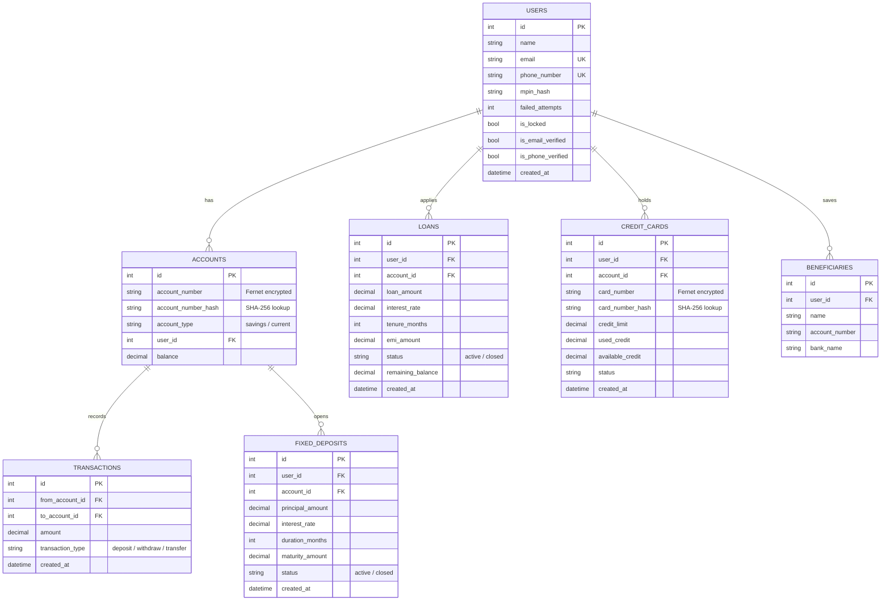
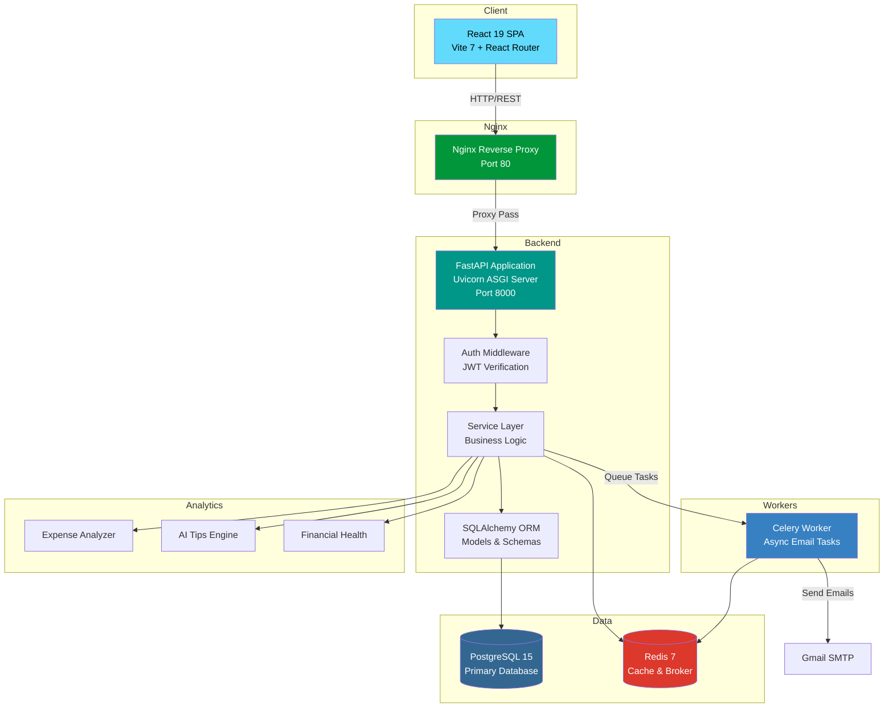

# Under Seas Bank — Full-Stack Digital Banking Application

<p align="center">
  
  
  
  
  
  
  
  
  
  
</p>

**Under Seas Bank** is a comprehensive, production-ready digital banking platform built with **FastAPI** and **React 19**, featuring secure OTP-based authentication, real-time transactions, loan management, credit cards, fixed deposits, and AI-powered financial analytics.

**Live Demo:** [https://underseas-bank.vercel.app](https://underseas-bank.vercel.app)

---

## 🚀 Key Features

### 🔐 Authentication & Security
- **JWT Token Authentication** — Secure token-based auth with `python-jose` and OAuth2 password flow
- **MPIN-Based Login** — Mobile-banking-style 4-digit MPIN instead of passwords
- **Dual OTP Verification** — Phone and Email OTP verification flows with configurable TTL
- **Account Lockout** — Automatic lockout after 5 consecutive failed login attempts
- **Field-Level Encryption** — Fernet-based AES encryption for sensitive fields (account numbers, card numbers) at rest
- **Lookup Hashing** — SHA-256 hash columns for fast lookups on encrypted fields
- **Bcrypt Password Hashing** — Salted hashing for MPIN storage
- **CORS Protection** — Configurable allowed origins via environment variables

### 🏦 Account Management
- **Multi-Account Support** — Create multiple savings/current accounts per user
- **Encrypted Account Numbers** — Account numbers encrypted at rest with Fernet, queryable via hash columns
- **Deposits & Withdrawals** — Secure operations with ownership verification
- **Fund Transfers** — Transfer between any two accounts with balance validation
- **Account Statements** — Detailed transaction history per account
- **Digital Passbook** — Passbook-style view of account activity

### 💳 Credit Cards
- **Credit Card Application** — Apply for virtual credit cards linked to an account
- **Encrypted Card Numbers** — Card numbers encrypted at rest using `EncryptedString` type
- **Credit Limit Management** — ₹50,000 default limit with used/available credit tracking
- **Make Purchases** — Simulate credit card purchases that deduct from available credit
- **Pay Bills** — Pay off credit card balance from linked account

### 🏦 Loans
- **Loan Application** — Apply for loans with custom amount, interest rate, and tenure
- **EMI Calculator** — Automatic EMI calculation using standard reducing-balance formula
- **EMI Payments** — Make EMI payments against active loans
- **Loan Tracking** — Track remaining balance and loan status (active/closed)

### 📈 Fixed Deposits
- **Create FDs** — Open fixed deposits with custom principal, rate, and duration
- **Maturity Calculation** — Automatic maturity amount computation
- **Premature Closure** — Close FDs before maturity with ownership verification
- **FD Portfolio View** — View all active and closed fixed deposits

### 👥 Beneficiary Management
- **Add Beneficiaries** — Save frequently-used payee details (name, account number, bank)
- **Quick Transfers** — Use saved beneficiaries for faster fund transfers

### 📊 Analytics & Financial Intelligence
- **Expense Analyzer** — Categorized breakdown of deposits, withdrawals, and transfers
- **AI Financial Tips** — Rule-based financial advice engine based on spending patterns
- **Financial Health Score** — Automatic health rating (Excellent / Good / Average / Poor) based on savings rate
- **Recharts Visualizations** — Interactive pie charts and bar graphs on the frontend

### 📧 Email Notifications
- **Welcome Emails** — Branded HTML emails on successful registration
- **OTP Delivery** — Email-based OTP for account verification
- **Celery Async Processing** — All emails sent asynchronously via Celery + Redis broker
- **Gmail SMTP** — Zero-cost email delivery using Google App Passwords

---

## 🛠️ Tech Stack

### Backend
| Technology | Purpose |
|---|---|
| [FastAPI](https://fastapi.tiangolo.com/) | Async web framework with auto-generated OpenAPI docs |
| [SQLAlchemy 2.0](https://www.sqlalchemy.org/) | ORM with relationship mapping |
| [PostgreSQL 15](https://www.postgresql.org/) | Primary relational database |
| [Redis 7](https://redis.io/) | Caching layer & Celery message broker |
| [Celery](https://docs.celeryq.dev/) | Distributed task queue for async email & processing |
| [Pydantic V2](https://docs.pydantic.dev/) | Request/response validation with `pydantic-settings` |
| [Alembic](https://alembic.sqlalchemy.org/) | Database migrations |
| [Cryptography (Fernet)](https://cryptography.io/) | AES field-level encryption at rest |
| [python-jose](https://python-jose.readthedocs.io/) | JWT token encoding/decoding |
| [Bcrypt](https://pypi.org/project/bcrypt/) | MPIN hashing |
| [Uvicorn](https://www.uvicorn.org/) | ASGI server |
| Python 3.11 | Runtime |

### Frontend
| Technology | Purpose |
|---|---|
| [React 19](https://react.dev/) | UI framework |
| [Vite 7](https://vite.dev/) | Build tool & dev server |
| [React Router 7](https://reactrouter.com/) | Client-side routing |
| [Recharts 3](https://recharts.org/) | Data visualization (pie charts, bar graphs) |
| Vanilla CSS | Custom glassmorphic design system |
| ESLint 9 | Code linting |

### Infrastructure
| Technology | Purpose |
|---|---|
| [Docker](https://www.docker.com/) | Containerization |
| [Docker Compose](https://docs.docker.com/compose/) | Multi-container orchestration |
| [Nginx](https://nginx.org/) | Reverse proxy |

---

## 📂 Project Structure

```
Under-Seas-Bank-python/
├── backend/
│   ├── app/
│   │   ├── analytics/               # Financial intelligence modules
│   │   │   ├── ai_tips_engine.py     # Rule-based financial tips
│   │   │   ├── expense_analyzer.py   # Categorized expense breakdown
│   │   │   └── financial_health.py   # Savings-rate-based health scoring
│   │   ├── middleware/
│   │   │   └── auth_middleware.py     # JWT token verification & get_current_user
│   │   ├── models/                   # SQLAlchemy database models
│   │   │   ├── user_model.py         # Users table (name, email, phone, MPIN)
│   │   │   ├── account_model.py      # Accounts with encrypted account numbers
│   │   │   ├── transaction_model.py  # Transaction ledger
│   │   │   ├── loan_model.py         # Loans with EMI tracking
│   │   │   ├── fixeddeposit_model.py # Fixed deposits with maturity
│   │   │   ├── creditcard_model.py   # Credit cards with encrypted numbers
│   │   │   ├── beneficiary_model.py  # Saved payee details
│   │   │   └── notification_model.py # Notification records
│   │   ├── routes/                   # API endpoint definitions
│   │   │   ├── auth_routes.py        # Register, login, OTP flows
│   │   │   ├── account_routes.py     # Account CRUD, statements, passbook
│   │   │   ├── transaction_routes.py # Deposit, withdraw, transfer, history
│   │   │   ├── loan_routes.py        # Loan apply, list, EMI payment
│   │   │   ├── fd_routes.py          # FD create, list, close
│   │   │   ├── creditcard_routes.py  # Card apply, purchase, bill payment
│   │   │   ├── analytics_routes.py   # Expense analytics
│   │   │   └── beneficiary_routes.py # Beneficiary management
│   │   ├── schemas/                  # Pydantic request/response models
│   │   ├── services/                 # Business logic layer
│   │   │   ├── auth_service.py       # Registration & login logic
│   │   │   ├── account_service.py    # Account operations
│   │   │   ├── transaction_service.py# Fund movement logic
│   │   │   ├── loan_service.py       # Loan processing & EMI
│   │   │   ├── fd_service.py         # Fixed deposit logic
│   │   │   ├── creditcard_service.py # Credit card operations
│   │   │   ├── email_service.py      # HTML email templates & SMTP
│   │   │   └── otp_service.py        # OTP generation & verification
│   │   ├── tasks/
│   │   │   └── email_tasks.py        # Celery async email tasks
│   │   ├── utils/
│   │   │   ├── encryption.py         # Fernet EncryptedString column type
│   │   │   ├── jwt_handler.py        # JWT create/decode helpers
│   │   │   ├── password_hash.py      # Bcrypt hashing utilities
│   │   │   ├── emi_calculator.py     # EMI formula implementation
│   │   │   └── lookup_hash.py        # SHA-256 hash for encrypted lookups
│   │   ├── main.py                   # FastAPI app entry point
│   │   ├── config.py                 # Pydantic settings (env-based)
│   │   ├── database.py               # SQLAlchemy engine & session
│   │   ├── celery_worker.py          # Celery app configuration
│   │   └── redis_client.py           # Redis connection client
│   ├── docker/
│   │   ├── Dockerfile                # Python 3.11 slim container
│   │   └── docker-compose.yml        # Full stack orchestration
│   ├── nginx/
│   │   └── nginx.conf                # Reverse proxy configuration
│   ├── tests/                        # Pytest test suite
│   ├── .env.example                  # Environment variable template
│   └── requirements.txt              # Python dependencies
│
├── frontend/
│   ├── src/
│   │   ├── components/               # Reusable UI components
│   │   │   ├── Sidebar.jsx           # Navigation sidebar
│   │   │   ├── Header.jsx            # Top header bar
│   │   │   ├── Card.jsx              # Reusable card component
│   │   │   ├── ExpenseChart.jsx      # Recharts expense visualization
│   │   │   └── TransactionTable.jsx  # Transaction history table
│   │   ├── layout/
│   │   │   └── MainLayout.jsx        # Dashboard layout wrapper
│   │   ├── pages/                    # Route page components
│   │   │   ├── Login.jsx             # Auth page (login + register + OTP)
│   │   │   ├── Dashboard.jsx         # Main dashboard with overview
│   │   │   ├── Accounts.jsx          # Account management
│   │   │   ├── Transfer.jsx          # Fund transfer page
│   │   │   ├── Transactions.jsx      # Transaction history
│   │   │   ├── Loans.jsx             # Loan management
│   │   │   ├── FixedDeposit.jsx      # FD management
│   │   │   ├── CreditCard.jsx        # Credit card management
│   │   │   ├── Analytics.jsx         # Expense analytics & charts
│   │   │   └── Beneficiaries.jsx     # Beneficiary management
│   │   ├── services/
│   │   │   └── api.js                # Centralized API client (fetch wrapper)
│   │   ├── App.jsx                   # Root component with routing
│   │   ├── App.css                   # App-level styles
│   │   ├── index.css                 # Global design system & CSS variables
│   │   └── main.jsx                  # React DOM entry point
│   ├── public/                       # Static assets
│   ├── index.html                    # HTML entry point
│   ├── package.json                  # Node dependencies
│   └── vite.config.js                # Vite configuration
│
├── documents/                        # Project documentation
│   ├── Code_Explanation_and_Imports.docx
│   ├── Logic_and_Algorithms.docx
│   └── build_showcase_docs.py        # Documentation generator script
│
├── LICENSE                           # MIT License
├── .gitignore                        # Git ignore rules
└── README.md                         # This file
```

---

## 🚀 Quick Start

### Prerequisites
- **Python 3.11+**
- **Node.js 18+** and **npm**
- **PostgreSQL 15**
- **Redis 7**
- **Docker** and **Docker Compose** (optional, for containerized setup)

---

### Option 1 — Docker (Recommended)

1. **Clone the repository**
   ```bash
   git clone https://github.com/Meet2206/Under-Seas-Bank-python.git
   cd Under-Seas-Bank-python
   ```

2. **Create environment file**
   ```bash
   cp backend/.env.example backend/.env
   # Edit backend/.env with your configuration
   ```

3. **Build and run all containers**
   ```bash
   cd backend/docker
   docker-compose up --build
   ```

   This starts: **FastAPI app** (`:8000`), **PostgreSQL** (`:5432`), **Redis** (`:6379`), **Celery worker**, and **Nginx** (`:80`).

---

### Option 2 — Local Development

1. **Clone the repository**
   ```bash
   git clone https://github.com/Meet2206/Under-Seas-Bank-python.git
   cd Under-Seas-Bank-python
   ```

2. **Backend setup**
   ```bash
   cd backend
   python -m venv venv
   source venv/bin/activate        # macOS/Linux
   # venv\Scripts\activate          # Windows
   pip install -r requirements.txt
   cp .env.example .env
   # Edit .env with your database URL, JWT secret, SMTP credentials, etc.
   ```

3. **Start PostgreSQL and Redis** (ensure they are running locally)

4. **Run the backend**
   ```bash
   cd backend
   uvicorn app.main:app --reload --port 8000
   ```

5. **Start the Celery worker** (separate terminal)
   ```bash
   cd backend
   celery -A app.celery_worker worker --loglevel=info
   ```

6. **Frontend setup**
   ```bash
   cd frontend
   npm install
   npm run dev
   ```

### Access the Application
| Service | URL |
|---|---|
| 🌐 Frontend | [http://localhost:5173](http://localhost:5173) |
| ⚡ Backend API | [http://localhost:8000](http://localhost:8000) |
| 📖 Swagger Docs | [http://localhost:8000/docs](http://localhost:8000/docs) |
| 📘 ReDoc | [http://localhost:8000/redoc](http://localhost:8000/redoc) |
| 🔀 Nginx Proxy (Docker) | [http://localhost](http://localhost) |

> **Note:** Swagger and ReDoc are only available when `DEBUG=True` in the `.env` file.

---

## ⚙️ Environment Variables

Create a `.env` file in the `backend/` directory using `.env.example` as a template:

| Variable | Description | Default |
|---|---|---|
| `DATABASE_URL` | PostgreSQL connection string | `postgresql://user@localhost:5432/bankbackenddb` |
| `SECRET_KEY` | JWT signing secret (use a long random string) | — |
| `ALGORITHM` | JWT algorithm | `HS256` |
| `ACCESS_TOKEN_EXPIRE_MINUTES` | Token TTL in minutes | `30` |
| `REDIS_URL` | Redis connection URL | `redis://localhost:6379/0` |
| `CELERY_BROKER_URL` | Celery broker URL | `redis://localhost:6379/0` |
| `CELERY_RESULT_BACKEND` | Celery result backend | `redis://localhost:6379/0` |
| `SMTP_HOST` | SMTP server hostname | `smtp.gmail.com` |
| `SMTP_PORT` | SMTP server port | `587` |
| `SMTP_USER` | SMTP username (your Gmail address) | — |
| `SMTP_PASSWORD` | Google App Password (16-char) | — |
| `EMAIL_FROM` | Sender email address | — |
| `OTP_EXPIRE_SECONDS` | OTP time-to-live | `300` |
| `FIELD_ENCRYPTION_KEY` | Fernet key for field-level encryption | — |
| `DEBUG` | Enable Swagger/ReDoc when `True` | `False` |
| `APP_NAME` | Application display name | `BankingSystem` |
| `CORS_ORIGINS` | Comma-separated allowed origins | `http://localhost:5173` |

### Generating the Encryption Key
```bash
python -c "from cryptography.fernet import Fernet; print(Fernet.generate_key().decode())"
```

---

## 📡 API Reference

All endpoints are prefixed and documented via Swagger at `/docs` when `DEBUG=True`.

### 🔐 Authentication — `/auth`
| Method | Endpoint | Description |
|---|---|---|
| `POST` | `/auth/register` | Register a new user (name, email, phone, MPIN) |
| `POST` | `/auth/login` | Login with phone number + MPIN → JWT token |
| `GET` | `/auth/me` | Get current authenticated user profile |
| `POST` | `/auth/send-phone-otp` | Send OTP to phone number |
| `POST` | `/auth/verify-phone` | Verify phone OTP → marks user as phone-verified |
| `POST` | `/auth/send-email-otp` | Send OTP to registered email |
| `POST` | `/auth/verify-email` | Verify email OTP → marks user as email-verified |

### 🏦 Accounts — `/accounts`
| Method | Endpoint | Description |
|---|---|---|
| `POST` | `/accounts/create` | Create a new bank account (savings/current) |
| `GET` | `/accounts/my-accounts` | List all accounts for the authenticated user |
| `GET` | `/accounts/statement/{account_id}` | Get account statement |
| `GET` | `/accounts/passbook/{account_id}` | Get passbook-style view |

### 💰 Transactions — `/transactions`
| Method | Endpoint | Description |
|---|---|---|
| `POST` | `/transactions/deposit` | Deposit funds into an account |
| `POST` | `/transactions/withdraw` | Withdraw funds from an account |
| `POST` | `/transactions/transfer` | Transfer funds between accounts |
| `GET` | `/transactions/history/{account_id}` | Get transaction history for an account |

### 🏦 Loans — `/loans`
| Method | Endpoint | Description |
|---|---|---|
| `POST` | `/loans/apply` | Apply for a loan (amount, rate, tenure) |
| `GET` | `/loans/my` | List all loans for the authenticated user |
| `POST` | `/loans/pay` | Make an EMI payment against a loan |

### 📈 Fixed Deposits — `/fd`
| Method | Endpoint | Description |
|---|---|---|
| `POST` | `/fd/create` | Open a new fixed deposit |
| `GET` | `/fd/my` | List all FDs for the authenticated user |
| `POST` | `/fd/close/{fd_id}` | Close (break) a fixed deposit |

### 💳 Credit Cards — `/credit-card`
| Method | Endpoint | Description |
|---|---|---|
| `POST` | `/credit-card/apply` | Apply for a credit card |
| `GET` | `/credit-card/my` | List all credit cards for the user |
| `POST` | `/credit-card/purchase` | Make a purchase using credit card |
| `POST` | `/credit-card/pay` | Pay credit card bill |

### 📊 Analytics — `/analytics`
| Method | Endpoint | Description |
|---|---|---|
| `GET` | `/analytics/expenses` | Get categorized expense breakdown (pie chart data) |

### 👥 Beneficiaries — `/beneficiaries`
| Method | Endpoint | Description |
|---|---|---|
| `POST` | `/beneficiaries/add` | Add a beneficiary (name, account, bank) |
| `GET` | `/beneficiaries/my` | List all saved beneficiaries |

### ❤️ Health Check
| Method | Endpoint | Description |
|---|---|---|
| `GET` | `/` | API status check |
| `GET` | `/health` | Health endpoint for monitoring |

---

## 🗄️ Database Schema



---

## 🏗️ Architecture



### Request Flow
```
Client → Nginx (port 80) → FastAPI (port 8000) → Auth Middleware (JWT)
  → Route Handler → Service Layer → SQLAlchemy ORM → PostgreSQL
  → Response (JSON) → Client
```

### Key Design Decisions
- **Service Layer Pattern** — Business logic is decoupled from routes, making it testable and reusable
- **Field-Level Encryption** — Sensitive identifiers (account numbers, card numbers) are Fernet-encrypted in the database with SHA-256 hash columns for indexed lookups
- **MPIN over Password** — Mobile-banking-style 4-digit MPIN for faster authentication
- **Celery for Side Effects** — Emails are sent asynchronously to avoid blocking request handlers
- **Pydantic Settings** — All configuration loaded from environment variables with type validation

---

## 🧪 Testing

### Run Backend Tests
```bash
cd backend
source venv/bin/activate
pytest -v
```

### Run Frontend Lint
```bash
cd frontend
npm run lint
```

### Run Frontend Dev Server
```bash
cd frontend
npm run dev
```

---

## 📱 Frontend Pages

| Route | Page | Description |
|---|---|---|
| `/` | Login | Authentication (login, register, OTP verification) |
| `/dashboard` | Dashboard | Account overview, quick stats, recent transactions |
| `/accounts` | Accounts | Create and manage bank accounts |
| `/transfer` | Transfer | Fund transfer between accounts |
| `/transactions` | Transactions | Full transaction history with filters |
| `/loans` | Loans | Apply for loans, view EMI details, make payments |
| `/fd` | Fixed Deposits | Create, view, and close fixed deposits |
| `/credit-card` | Credit Cards | Apply, make purchases, pay bills |
| `/analytics` | Analytics | Expense breakdown charts and financial insights |
| `/beneficiaries` | Beneficiaries | Add and manage saved beneficiaries |

---

## 🐳 Docker Services

| Service | Image | Port | Purpose |
|---|---|---|---|
| `app` | Custom (Python 3.11-slim) | 8000 | FastAPI backend |
| `db` | `postgres:15` | 5432 | PostgreSQL database |
| `redis` | `redis:7-alpine` | 6379 | Cache & message broker |
| `celery_worker` | Custom (Python 3.11-slim) | — | Async task processing |
| `nginx` | `nginx:alpine` | 80 | Reverse proxy |

---

## 📄 Documentation

The `documents/` directory contains additional project documentation:

- **Code_Explanation_and_Imports.docx** — Detailed explanation of all imports and code modules
- **Logic_and_Algorithms.docx** — Business logic, algorithms, and formula documentation
- **build_showcase_docs.py** — Script to auto-generate showcase documentation

---

## 🤝 Contributing

Contributions are welcome! Here's how to get started:

1. **Fork** the repository
2. **Create** a feature branch
   ```bash
   git checkout -b feature/amazing-feature
   ```
3. **Commit** your changes
   ```bash
   git commit -m "feat: add amazing feature"
   ```
4. **Push** to the branch
   ```bash
   git push origin feature/amazing-feature
   ```
5. **Open** a Pull Request

### Guidelines
- Follow the existing code structure and naming conventions
- Add Pydantic schemas for all new request/response models
- Keep business logic in the `services/` layer, not in routes
- Write docstrings for all new endpoints
- Test your changes before submitting

---

## 📜 License

This project is licensed under the **MIT License** — see the [LICENSE](LICENSE) file for details.

---

## 👤 Author

**Meet Limbachiya**

- GitHub: [@Meet2206](https://github.com/Meet2206)
- Repository: [Under-Seas-Bank-python](https://github.com/Meet2206/Under-Seas-Bank-python)

---

<p align="center">
  Engineered and developed by Meet Limbachiya
</p>
